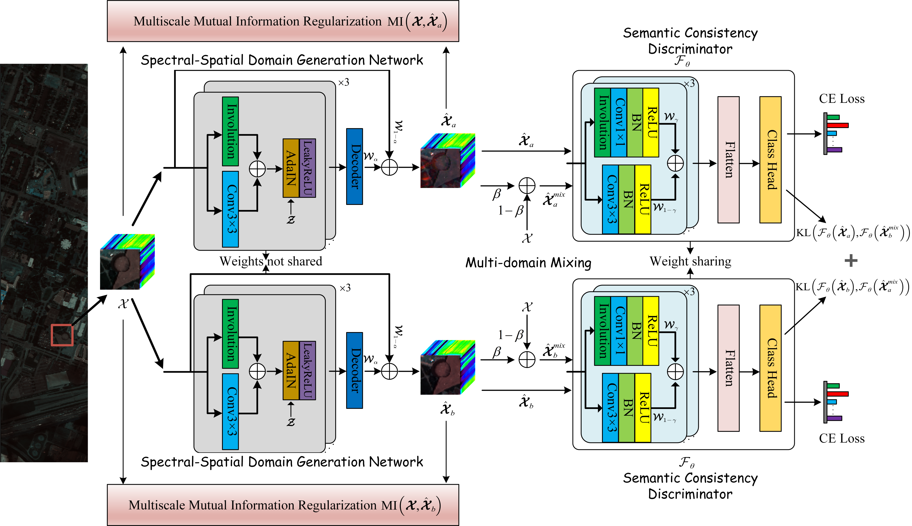

# S2AMSnet
# Spectral–Spatial Adversarial Multidomain Synthesis Network for Cross-Scene Hyperspectral Image Classification (TGRS2024)

Paper web page:[Spectral–Spatial Adversarial Multidomain Synthesis Network for Cross-Scene Hyperspectral Image Classification](https://ieeexplore.ieee.org/document/10531019).



# Abstract:
Cross-scene hyperspectral image (HSI) classification has received widespread attention due to its practicality. However, domain adaptation (DA)-based cross-scene HSI classification methods are typically tailored for a specific target scene involved in model training and require retraining for new scenes. We instead propose a novel spectral–spatial adversarial multidomain synthetic network ($\mathrm{S}^2\mathrm{AMSnet}$) that can be trained on a single source domain (SD) and generalized to unseen domains. $\mathrm{S}^2\mathrm{AMSnet}$ improves the robustness of the model to the unseen domain by expanding the diverse distribution of the SD. Specifically, to spatially and spectrally generate diversified generative domain (GD), the spectral–spatial domain-generation network ($\mathrm{S}^2\mathrm{DGN}$) is designed, and two S2DGNs with the same structure but not shared parameters are enabled to generate diversified GD through two-step min–max strategy. A Multidomain mixing module is employed to expand the diversity of the GD further and enhance their class-domain semantic consistency information. In addition, a multiscale mutual information (MI) regularization network (MMIRN) is used to constrain the $\mathrm{S}^2\mathrm{DGN}$ so that the intrinsic class semantic information of its generated GD does not deviate from the SD. A semantic consistency discriminator with spectral–spatial feature extraction capability is utilized to capture class-domain semantic consistency information from diverse GD to obtain cross-domain invariant knowledge. Comparative analysis with eight state-of-the-art transfer learning methods on three real HSI datasets, along with an ablation study, validates the effectiveness of the proposed $\mathrm{S}^2\mathrm{AMSnet}$ in the cross-scene HSI classification task.

# Citation：
Please cite us if our project is helpful to you!
```
@ARTICLE{10531019,
  author={Chen, Xi and Gao, Lin and Zhang, Maojun and Chen, Chen and Yan, Shen},
  journal={IEEE Transactions on Geoscience and Remote Sensing}, 
  title={Spectral–Spatial Adversarial Multidomain Synthesis Network for Cross-Scene Hyperspectral Image Classification}, 
  year={2024},
  volume={62},
  number={},
  pages={1-16},
  keywords={Semantics;Training;Data models;Mutual information;Hyperspectral imaging;Task analysis;Solid modeling;Cross-scene classification;hyperspectral images (HSIs);mutual information (MI) regularization;single-source domain (SD) generalization},
  doi={10.1109/TGRS.2024.3401231}}
```

# Requirements：
```
1. torch==1.11.0+cu113
2. python==3.8.3
3. mmcv==1.3.0
4. cupy-cuda110==8.5.0
```
# Usage:
Houston datasets:
```
python main.py --source_name Houston13 --target_name Houston18 --patch_size 13 --training_sample_ratio 0.8
```
